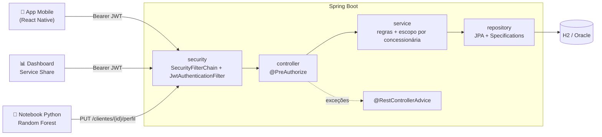
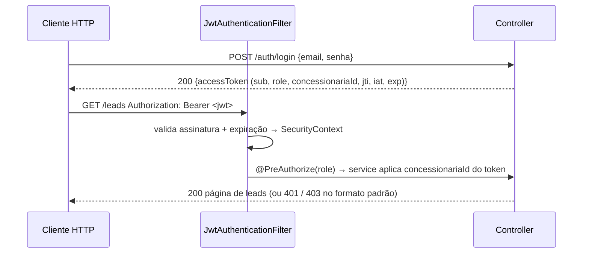

# Ford Retention AI – API REST

> Challenge Ford × FIAP 2026 – **Desafio 02: impulsionar o VIN Share / Service Share da Ford na América do Sul**

O **Service Share** mede quantos clientes dos últimos anos fizeram um serviço **pago** em uma
concessionária Ford no último ano. Ele é alto nos carros novos e despenca a partir do 4º ano de uso,
e o parque antigo ainda é cerca de 70% da frota. Esta API é o back-end da solução **Ford Retention AI**:

- gerencia **concessionárias, clientes, veículos (VIN) e histórico de serviços**;
- recebe o **perfil de retenção** calculado pelo nosso modelo de ML (Random Forest, ~95% de acurácia):
  **Fiel**, **Abandono**, **Esquecido** e **Econômico**;
- **gera leads proativos automaticamente** quando um cliente é classificado como Abandono/Esquecido com
  score de risco alto, e fecha o ciclo marcando o lead como **CONVERTIDO** quando um serviço pago é registrado;
- calcula o **Service Share** de cada concessionária com recortes por **idade do veículo, modelo e tipo de serviço**,
  para os dashboards;
- atende o **app mobile (React Native)** dos consultores e gestores.

## Integrantes

| Nome | RM |
|---|---|
| Felipe Braunstein e Silva | RM554483 |
| Felipe do Nascimento Fernandes | RM554598 |
| Henrique Ignacio Bartalo | RM555274 |
| Gustavo Henrique Martins | RM556956 |

---

## Sumário

1. [Stack](#stack)
2. [Arquitetura](#arquitetura)
3. [Como rodar](#como-rodar)
4. [Variáveis de ambiente](#variáveis-de-ambiente)
5. [Usuários de teste](#usuários-de-teste)
6. [Autenticação e autorização](#autenticação-e-autorização)
7. [Endpoints](#endpoints)
8. [Exemplos com curl](#exemplos-com-curl)
9. [Tratamento de erros](#tratamento-de-erros)
10. [Testes e cobertura](#testes-e-cobertura)
11. [Segurança e DevSecOps](#segurança-e-devsecops)
12. [Mapa dos critérios de avaliação](#mapa-dos-critérios-de-avaliação)

---

## Stack

| Item | Tecnologia |
|---|---|
| Linguagem / build | Java 21, Maven |
| Framework | Spring Boot 3.5 (Web, Data JPA, Security, Validation, Actuator) |
| Autenticação | JWT HS256 com **jjwt 0.12**, senhas com **BCrypt** |
| Segurança | Rate limiting com **Bucket4j**, **AES-256-GCM** para dados pessoais, logs estruturados em JSON |
| Observabilidade | Actuator + **Micrometer/Prometheus** |
| DevSecOps | GitHub Actions (Gitleaks, Semgrep, Trivy), Dependabot, Dockerfile não-root |
| Banco | **H2** em memória (dev/test) e **Oracle** (perfil `prod`) |
| Documentação | springdoc-openapi 2.8 (Swagger UI) |
| Testes | JUnit 5, Mockito, MockMvc, spring-security-test, AssertJ, JaCoCo |

DTOs são `record`s; não usamos Lombok.

## Arquitetura

O documento completo, com 5 diagramas Mermaid (componentes, login, requisição protegida, fluxo ML → lead e
modelo ER), está em **[docs/ARQUITETURA.md](docs/ARQUITETURA.md)**. Há também uma versão para impressão em
**[docs/Ford-Retention-AI-Arquitetura.pdf](docs/Ford-Retention-AI-Arquitetura.pdf)**, com os diagramas,
a matriz de autorização e a integração com o ML. Resumo:





Camadas: `controller → service → repository`, com `dto`, `mapper`, `security`, `exception` e `config`.

## Como rodar

**Pré-requisitos:** JDK 21+ e Maven 3.9+.

```bash
# 1. Segredos obrigatórios: a aplicação não sobe sem eles
export JWT_SECRET="$(openssl rand -base64 48)"            # assinatura do JWT
export FIELD_ENCRYPTION_KEY="$(openssl rand -base64 32)"  # AES-256 dos dados pessoais

# 2. Subir no perfil dev (H2 em memória + dados de exemplo do data.sql)
mvn spring-boot:run

# (opcional) logs em JSON, como em produção
LOGGING_STRUCTURED_FORMAT_CONSOLE=logstash mvn spring-boot:run
```

Ou gere o jar:

```bash
mvn clean package
java -jar target/ford-retention-ai-1.0.0.jar   # com as variáveis acima exportadas
```

Ou com Docker (perfil `prod`, segredos passados em runtime, nunca na imagem):

```bash
docker build -t ford-retention-ai .
docker run --env-file .env -p 8080:8080 ford-retention-ai
```

| Recurso | URL |
|---|---|
| API | http://localhost:8080 |
| Swagger UI | http://localhost:8080/swagger-ui.html |
| OpenAPI JSON | http://localhost:8080/v3/api-docs |
| Health check | http://localhost:8080/actuator/health |
| Métricas (Prometheus) | http://localhost:8080/actuator/prometheus (no `prod`, porta interna `9091`) |

No Swagger, faça login em `POST /auth/login`, copie o `accessToken`, clique em **Authorize** e cole o token.

### Perfil `prod` (Oracle da FIAP)

Validado contra o **Oracle Database 19c** da FIAP (`oracle.fiap.com.br`). As credenciais ficam em um
arquivo `.env` local, que é ignorado pelo git:

```bash
cp .env.example .env        # preencha DB_USERNAME (RM) e DB_PASSWORD
set -a; source .env; set +a

# 1ª execução: cria as 6 tabelas e carrega os dados de exemplo
SPRING_PROFILES_ACTIVE=prod DB_SEED=always mvn spring-boot:run

# execuções seguintes (os dados já estão no banco)
SPRING_PROFILES_ACTIVE=prod mvn spring-boot:run
```

- **Tabelas:** o Hibernate (`ddl-auto=update`) cria as 6 tabelas da API (`CONCESSIONARIAS`, `USUARIOS`,
  `CLIENTES`, `VEICULOS`, `SERVICOS`, `LEADS`) com colunas `IDENTITY`, disponíveis a partir do Oracle 12c.
  Outras tabelas que já existam no schema não são alteradas.
- **Dados de exemplo:** com `DB_SEED=always`, o script
  [`db/oracle/data.sql`](src/main/resources/db/oracle/data.sql) (PL/SQL) carrega os mesmos dados de exemplo do
  perfil dev, com os mesmos IDs e usuários de teste. Ele é **idempotente**: só insere se a tabela
  `CONCESSIONARIAS` estiver vazia, então rodar de novo não duplica nada.
- **Conexões:** o pool de conexões é pequeno (3), porque o Oracle da FIAP é compartilhado e limita sessões
  por usuário.
- **Telefone cifrado:** se as tabelas foram criadas antes da versão com criptografia, aumente a coluna uma vez:
  `ALTER TABLE clientes MODIFY telefone VARCHAR2(100);`. Os telefones antigos em texto puro são cifrados
  automaticamente na próxima subida.

## Variáveis de ambiente

Há um modelo em [`.env.example`](.env.example).

| Variável | Obrigatória | Padrão | Descrição |
|---|---|---|---|
| `JWT_SECRET` | **sim** | – | Segredo HMAC do JWT, com no mínimo 32 caracteres. Nunca fica no código. |
| `FIELD_ENCRYPTION_KEY` | **sim** | – | Chave AES-256 (Base64, 32 bytes) que cifra o telefone dos clientes no banco. `openssl rand -base64 32` |
| `JWT_EXPIRATION` | não | `15m` | Validade do token (`30m`, `2h`, `PT1H`…). Curta porque não há revogação de token. |
| `JWT_ISSUER` | não | `ford-retention-ai` | Claim `iss`, validada na leitura do token. |
| `SPRING_PROFILES_ACTIVE` | não | `dev` | `dev` (H2 + data.sql) ou `prod` (Oracle). |
| `DB_URL`, `DB_USERNAME`, `DB_PASSWORD` | no `prod` | – | Conexão Oracle. |
| `DDL_AUTO` | não | `update` | Estratégia do Hibernate no `prod`. |
| `DB_SEED` | não | `never` | `always` carrega os dados de exemplo no Oracle (idempotente). |
| `DB_POOL_SIZE` | não | `3` | Conexões simultâneas com o Oracle. |
| `LEAD_SCORE_LIMITE` | não | `0.70` | Score mínimo para gerar lead automático. |
| `CORS_ALLOWED_ORIGINS` | não | localhost 3000/8081/19006 | Origens do dashboard e do app. |
| `SERVER_PORT` | não | `8080` | Porta HTTP. |
| `MANAGEMENT_PORT` | não | `9091` (prod) | Porta interna do Actuator no `prod`. |
| `RATE_LIMIT_LOGIN` / `RATE_LIMIT_USUARIO` / `RATE_LIMIT_ANONIMO` | não | `5` / `100` / `60` | Requisições por minuto (login por IP, por usuário autenticado, anônimas por IP). |
| `RATE_LIMIT_ENABLED` | não | `true` | Liga/desliga o rate limiting. |
| `LOG_FORMAT` | não | `logstash` (prod) | Formato dos logs estruturados no `prod`. |

## Usuários de teste

Carregados pelo `data.sql` no perfil `dev` e pelo `db/oracle/data.sql` no `prod` (com `DB_SEED=always`). **Senha de todos: `Ford@2026`**

| E-mail | Perfil | Concessionária | Observação |
|---|---|---|---|
| `admin@ford.com` | ADMIN | – | Equipe Ford, acesso total |
| `ml-service@ford.com` | ADMIN | – | Usuário técnico do notebook de ML |
| `gestor.sp@fordcentral.com.br` | GESTOR_CONCESSIONARIA | 1 – Ford Central Paulista (SP) | |
| `gestor.rj@fordriosul.com.br` | GESTOR_CONCESSIONARIA | 2 – Ford Rio Sul (RJ) | |
| `consultor.sp@fordcentral.com.br` | CONSULTOR | 1 – Ford Central Paulista (SP) | |
| `consultor.rj@fordriosul.com.br` | CONSULTOR | 2 – Ford Rio Sul (RJ) | |
| `pendente@fordcentral.com.br` | CONSULTOR | 1 | Inativo: o login retorna 401 até ser aprovado |

O `data.sql` também cria 3 concessionárias, 10 clientes com os 4 perfis, 11 veículos (de 2017 a 2025),
11 serviços com datas relativas a hoje e 6 leads em várias etapas do funil. Com esses dados, o
Service Share da concessionária 1 mostra a queda nos veículos antigos: **66,67%** para 0–3 anos, **100%**
para 4–6 anos e **0%** para 7+ anos.

## Autenticação e autorização

- **Públicos:** `POST /auth/login`, `POST /auth/register`, Swagger (`/swagger-ui/**`, `/v3/api-docs/**`),
  `GET /actuator/health` e `GET /actuator/prometheus`. Os demais endpoints do Actuator são negados. Todo o
  resto exige `Authorization: Bearer <token>`.
- **JWT:** gerado no login com as claims `sub` (e-mail), `uid`, `nome`, `role`, `concessionariaId`
  (ausente para ADMIN), `jti`, `iss`, `iat` e `exp`, com validade padrão de **15 minutos**. Um
  `OncePerRequestFilter` valida assinatura, emissor e expiração, e recusa token sem `exp`. Token ausente,
  inválido ou expirado resulta em **401**.
- **Rate limiting:** `POST /auth/login` aceita 5 tentativas por minuto por IP; usuários autenticados,
  100 requisições por minuto. Acima disso a resposta é **429** com o header `Retry-After`.
- **Perfis:**
  - **ADMIN:** acesso total. É o único que grava o perfil do ML, cria concessionárias e usuários e exclui leads.
  - **GESTOR_CONCESSIONARIA:** CRUD de clientes, veículos, serviços e leads **apenas da própria
    concessionária** (o `concessionariaId` vem do token). Vê o Service Share e aprova consultores.
  - **CONSULTOR:** consulta os dados da própria concessionária e **atualiza o status dos leads**
    (`PATCH /leads/{id}/status`).
- **Duas camadas:** regras por URL no `SecurityFilterChain` e `@PreAuthorize` nos controllers. Os services
  aplicam o escopo por concessionária. Recurso de outra concessionária retorna **404**, para não revelar
  que ele existe. Payload que aponta para outra concessionária retorna **403**.
- **Auto-cadastro seguro:** `POST /auth/register` cria sempre um `CONSULTOR` **inativo**. A conta
  precisa ser aprovada via `PATCH /usuarios/{id}/ativacao` por um ADMIN ou pelo gestor da concessionária.
- Senhas são armazenadas com **BCrypt**.

A matriz completa de permissões está em [docs/ARQUITETURA.md](docs/ARQUITETURA.md#5-matriz-de-autorização).

## Endpoints

Todas as listagens são paginadas (`?page=0&size=20&sort=campo,asc`, máximo de 100 por página) e retornam
`{content, page, size, totalElements, totalPages, first, last}`.

| Recurso | Métodos | Filtros de listagem |
|---|---|---|
| `/auth/login`, `/auth/register` | POST | – |
| `/usuarios`, `/usuarios/{id}`, `/usuarios/{id}/ativacao` | GET, POST, PATCH | – |
| `/concessionarias`, `/concessionarias/{id}` | GET, POST, PUT, PATCH, DELETE | `nome`, `cidade`, `estado` |
| `/concessionarias/{id}/service-share` | GET | `meses` (1–60, padrão 12) |
| `/clientes`, `/clientes/{id}` | GET, POST, PUT, PATCH, DELETE | `nome`, `perfil`, `scoreMin`, `concessionariaId`* |
| `/clientes/{id}/perfil` | GET, PUT | – |
| `/veiculos`, `/veiculos/{id}` | GET, POST, PUT, PATCH, DELETE | `modelo`, `idadeMin`, `idadeMax`, `clienteId`, `statusGarantia`, `concessionariaId`* |
| `/servicos`, `/servicos/{id}` | GET, POST, PUT, DELETE | `tipo`, `pago`, `dataInicio`, `dataFim`, `veiculoId`, `concessionariaId`* |
| `/leads`, `/leads/{id}` | GET, POST, PUT, DELETE | `status`, `perfil`, `prioridade`, `origem`, `clienteId`, `concessionariaId`* |
| `/leads/{id}/status` | PATCH | – |

\* O filtro `concessionariaId` só vale para o ADMIN. Para os demais perfis, ele é sempre substituído pela
concessionária do token.

**Status codes usados:** 200, 201 (com header `Location`), 204, 400, 401, 403, 404, 409, 413, 422 e 429.

### Regras de negócio principais

| Regra | Resultado |
|---|---|
| ML envia perfil `ABANDONO`/`ESQUECIDO` com score ≥ 0.70 | Cria um lead `MODELO_ML` por veículo sem lead ativo. Prioridade: ≥0.90 ALTA, ≥0.80 MEDIA, abaixo BAIXA. |
| Serviço **pago** registrado para um veículo | Os leads ativos do veículo passam a `CONVERTIDO`. |
| Funil do lead | `ABERTO → CONTATADO/AGENDADO/PERDIDO`, `CONTATADO → AGENDADO/PERDIDO`, `AGENDADO → CONVERTIDO/CONTATADO/PERDIDO`. Qualquer outra transição retorna **422**. |
| Serviço com data futura; `RECALL`/`GARANTIA` marcados como pagos; `GARANTIA` com garantia expirada | **422** |
| Quilometragem menor que a atual; ano do veículo > ano atual + 1 | **422** |
| CNPJ, e-mail, VIN ou lead ativo duplicados; exclusão com vínculos | **409** |

## Exemplos com curl

```bash
API=http://localhost:8080

# Login (guarda o token em variáveis)
ADMIN=$(curl -s $API/auth/login -H 'Content-Type: application/json' \
  -d '{"email":"admin@ford.com","senha":"Ford@2026"}' | jq -r .accessToken)
GESTOR=$(curl -s $API/auth/login -H 'Content-Type: application/json' \
  -d '{"email":"gestor.sp@fordcentral.com.br","senha":"Ford@2026"}' | jq -r .accessToken)
CONSULTOR=$(curl -s $API/auth/login -H 'Content-Type: application/json' \
  -d '{"email":"consultor.sp@fordcentral.com.br","senha":"Ford@2026"}' | jq -r .accessToken)

# Service Share da concessionária do gestor, com recortes por idade/modelo/tipo
curl -s "$API/concessionarias/1/service-share?meses=12" -H "Authorization: Bearer $GESTOR" | jq

# Rangers com 4 anos ou mais
curl -s "$API/veiculos?modelo=Ranger&idadeMin=4" -H "Authorization: Bearer $ADMIN" | jq

# Leads abertos de clientes com perfil de abandono (fila do consultor)
curl -s "$API/leads?status=ABERTO&perfil=ABANDONO&sort=prioridade" -H "Authorization: Bearer $CONSULTOR" | jq

# Serviço de ML grava o perfil calculado → gera lead automaticamente (veja "leadsGerados")
curl -s -X PUT $API/clientes/5/perfil -H "Authorization: Bearer $ADMIN" \
  -H 'Content-Type: application/json' -d '{"perfil":"ESQUECIDO","scoreRisco":0.93}' | jq

# Consultor avança o lead no funil
curl -s -X PATCH $API/leads/1/status -H "Authorization: Bearer $CONSULTOR" \
  -H 'Content-Type: application/json' -d '{"status":"CONTATADO","observacao":"Cliente pediu retorno"}' | jq

# Gestor cadastra cliente → 201 + header Location
curl -si -X POST $API/clientes -H "Authorization: Bearer $GESTOR" -H 'Content-Type: application/json' \
  -d '{"nome":"Ana Lima","email":"ana.lima@email.com","telefone":"+5511988887777","concessionariaPreferidaId":1}'

# Registrar serviço pago → converte o lead ativo do veículo
curl -s -X POST $API/servicos -H "Authorization: Bearer $GESTOR" -H 'Content-Type: application/json' \
  -d "{\"veiculoId\":3,\"concessionariaId\":1,\"tipo\":\"REVISAO\",\"valor\":980.00,\"data\":\"$(date +%F)\",\"pago\":true}" | jq

# Auto-cadastro de consultor (fica inativo) e aprovação pelo gestor
curl -s -X POST $API/auth/register -H 'Content-Type: application/json' \
  -d '{"nome":"Novo Consultor","email":"novo@fordcentral.com.br","senha":"Senha1234","concessionariaId":1}' | jq
curl -s -X PATCH $API/usuarios/100/ativacao -H "Authorization: Bearer $GESTOR" \
  -H 'Content-Type: application/json' -d '{"ativo":true}' | jq

# Casos de erro
curl -s $API/leads | jq                                            # 401 sem token
curl -s -X DELETE $API/leads/1 -H "Authorization: Bearer $CONSULTOR" | jq  # 403 role errada
curl -s $API/clientes/6 -H "Authorization: Bearer $GESTOR" | jq     # 404 cliente de outra concessionária
curl -s -X PATCH $API/leads/6/status -H "Authorization: Bearer $CONSULTOR" \
  -H 'Content-Type: application/json' -d '{"status":"ABERTO"}' | jq # 422 transição inválida
```

## Tratamento de erros

Todos os erros, inclusive os 401 e 403 gerados pela camada de segurança, seguem o mesmo formato:

```json
{
  "timestamp": "2026-09-24T21:40:00Z",
  "status": 400,
  "error": "Bad Request",
  "message": "Dados inválidos",
  "path": "/clientes",
  "fieldErrors": [
    { "field": "email", "message": "deve ser um endereço de e-mail bem formado" },
    { "field": "nome",  "message": "não deve estar em branco" }
  ]
}
```

O `GlobalExceptionHandler` (`@RestControllerAdvice`) trata:
- **400:** Bean Validation, JSON malformado, tipo ou enum inválido, parâmetro ausente e ordenação inválida.
- **401:** credenciais inválidas ou conta pendente.
- **403:** `@PreAuthorize` negado.
- **404:** recurso inexistente ou rota inexistente.
- **405 / 415:** método ou Content-Type não suportado.
- **409:** conflito ou violação de integridade.
- **413:** corpo da requisição acima de 64 KB.
- **422:** regra de negócio violada.
- **429:** limite de requisições excedido (header `Retry-After` em segundos).
- **500:** erro genérico, logado sem expor detalhes internos.

## Testes e cobertura

```bash
mvn test
```

Esse comando roda **169 testes** e gera o relatório do JaCoCo em
**`target/site/jacoco/index.html`** (também há `jacoco.xml` e `jacoco.csv` para CI).
A cobertura atual é de cerca de **87% das linhas**. No GitHub, o mesmo `mvn verify` roda a cada PR no
pipeline `devsecops`.

Para rodar só uma classe ou um grupo de testes:

```bash
mvn test -Dtest=LeadServiceTest
mvn test -Dtest='*IT'        # apenas integração
mvn test -Dtest='*Test'      # apenas unitários
```

| Tipo | Classes | O que cobrem |
|---|---|---|
| Unitários (Mockito) | `LeadServiceTest`, `PerfilClienteServiceTest`, `ServiceShareServiceTest`, `ConcessionariaServiceTest`, `VeiculoServiceTest`, `ServicoServiceTest`, `UsuarioServiceTest` | Regras de negócio, geração automática de leads, cálculo do Service Share, escopo, 404, 409 e 422 |
| Unitários | `JwtServiceTest`, `RegrasDominioTest`, `CriptografiaCampoTest` | Claims do JWT, expiração, token sem `exp`, assinatura adulterada, emissor, segredo fraco, máquina de estados, prioridade e AES-GCM (IV, adulteração, chave errada) |
| Integração (MockMvc) | `AuthControllerIT`, `SegurancaIT`, `ConcessionariaControllerIT`, `ClienteControllerIT`, `PerfilClienteControllerIT`, `VeiculoControllerIT`, `ServicoControllerIT`, `LeadControllerIT`, `UsuarioControllerIT` | Fluxo HTTP completo com **JWT real** e com `@WithMockUser`: sucesso (200/201/204), **400**, **401** (sem token, inválido, expirado), **403** (role errada), **404**, 409, 413 e 422 |
| Integração de segurança | `RateLimitIT`, `IsolamentoConcessionariaIT`, `CriptografiaDadosPessoaisIT`, `ActuatorIT` | **429** no login e por usuário, isolamento entre concessionárias (BOLA), telefone cifrado no banco e Actuator restrito |

Os testes de integração usam o perfil `test` (H2 isolado, sem `data.sql`). Cada teste monta o próprio
cenário e roda em uma transação revertida ao final.

## Segurança e DevSecOps

Detalhes, mapa para OWASP/LGPD e roteiro de testes em **[README-SECURITY.md](README-SECURITY.md)**. Resumo:

- **Pipeline** [`.github/workflows/devsecops.yml`](.github/workflows/devsecops.yml), a cada PR, push na `main`,
  semanalmente e sob demanda: Gitleaks (segredos), Semgrep (SAST), Trivy (dependências, Dockerfile e imagem),
  `mvn verify` e o job **`security-gate`**, que precisa passar para o merge na `main`.
- **Dependabot** para Maven, GitHub Actions e imagens Docker.
- **Container** multi-stage, só com JRE, usuário não-root e sem segredos na imagem.
- **Logs estruturados** (JSON no `prod`) com `traceId` e eventos como `auth.login_falha`,
  `authz.acesso_negado`, `authz.fora_do_escopo`, `rate_limit.excedido` e `lead.status_alterado`, sem dados pessoais.
- **`infra/`**: broker MQTT só com TLS/mTLS e ACL por VIN, Prometheus + Grafana (dashboard "Segurança da API" e
  alertas de força bruta e enumeração) e scripts de backup cifrado com restauração testada.
- A branch `main` é protegida: merge só por PR com o check `security-gate` verde.

## Mapa dos critérios de avaliação

| Critério | Onde está |
|---|---|
| Arquitetura (20%) | `docs/ARQUITETURA.md` (5 diagramas Mermaid) e `docs/Ford-Retention-AI-Arquitetura.pdf`, pacotes `controller/service/repository/dto/mapper/security/exception/config` |
| Autenticação e autorização (20%) | `config/SecurityConfig`, `@PreAuthorize` nos controllers, `service/EscopoAcessoService`, BCrypt, auto-cadastro com aprovação |
| JWT (15%) | `security/JwtService`, `JwtAuthenticationFilter`, `JwtProperties` (segredo via `JWT_SECRET`, validade de 15 min, `jti`, token sem `exp` recusado) |
| Maturidade REST nível 2 (20%) | Recursos no plural, verbos corretos, 201 + Location, 204, 400–422, paginação e filtros, `/concessionarias/{id}/service-share` |
| Testes automatizados (15%) | 169 testes (Mockito + MockMvc + spring-security-test) e JaCoCo, rodando no GitHub Actions |
| Documentação e erros (10%) | Swagger com esquema Bearer, `@RestControllerAdvice` com `ApiError`, este README |
