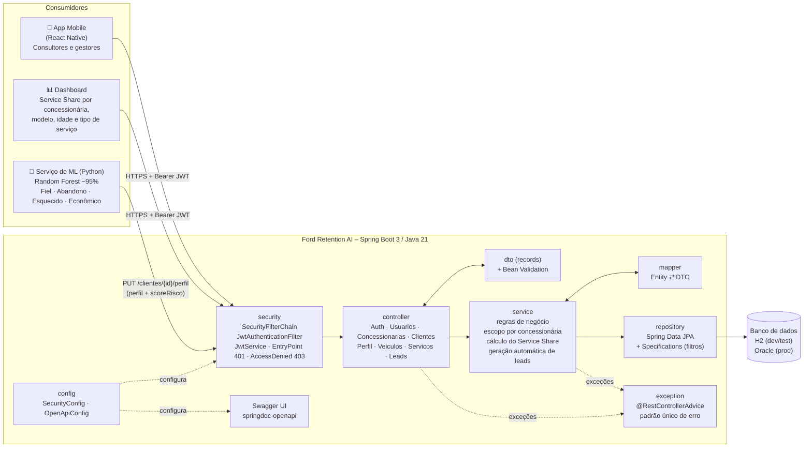
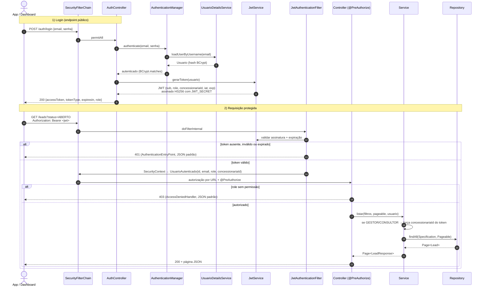
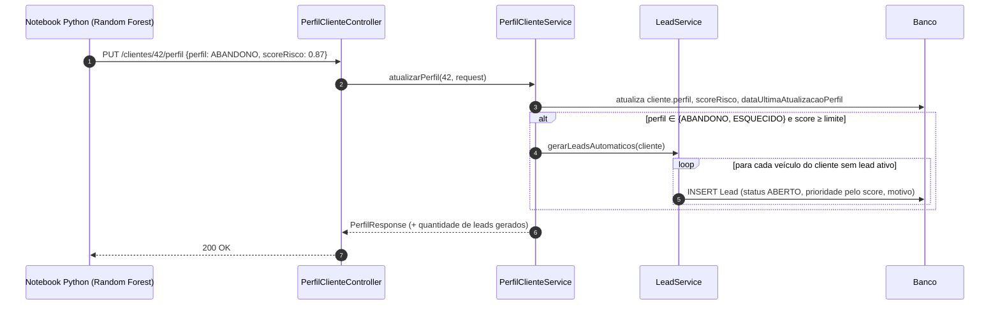
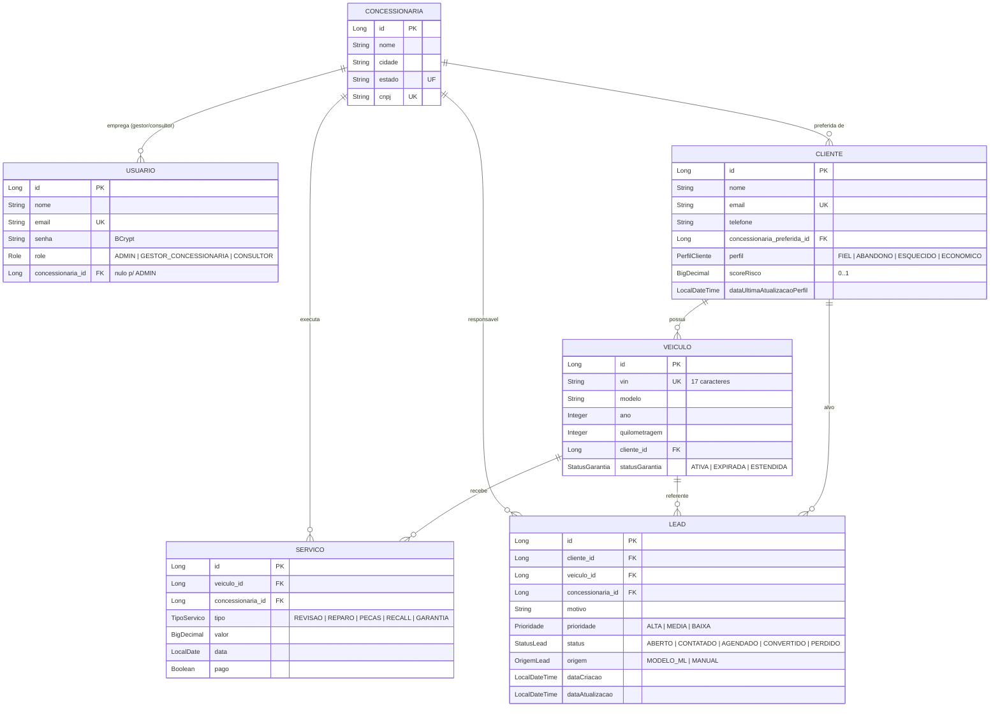

# Ford Retention AI – Arquitetura da API

API REST que sustenta o app mobile (React Native) e os dashboards de **Service Share / VIN Share**
da Ford na América do Sul. Ela gerencia concessionárias, clientes, veículos e histórico de serviços,
recebe o perfil de retenção calculado pelo modelo de ML (Random Forest) e gera **leads proativos**
para as concessionárias.

---

## 1. Visão de componentes



### Responsabilidades por camada

| Pacote | Responsabilidade |
|---|---|
| `controller` | Só HTTP: recebe e valida os DTOs (`@Valid`), aplica `@PreAuthorize`, devolve o status certo (201 + `Location`, 204…). Não tem regra de negócio. |
| `service` | Regras de negócio e transações (`@Transactional`), escopo de dados pelo `concessionariaId` do token, cálculo do Service Share e geração automática de leads. |
| `repository` | Acesso a dados com Spring Data JPA. Os filtros dinâmicos das listagens usam `Specification`. |
| `model` | Entidades JPA e enums do domínio. |
| `dto` | Contratos de entrada e saída (records). As entidades nunca saem da API. |
| `mapper` | Conversão entre entidade e DTO, sem dependências externas. |
| `security` | Geração e validação do JWT, filtro `OncePerRequestFilter`, `UserDetailsService` e os handlers de 401/403 no mesmo formato de erro da API. |
| `exception` | Exceções de domínio e o `GlobalExceptionHandler` com o formato único de erro. |
| `config` | `SecurityFilterChain`, `PasswordEncoder` (BCrypt), OpenAPI com o esquema Bearer, `Clock` injetável e `LeadProperties` (limite do score). |

### Onde entra cada consumidor

- **App mobile:** consultores veem e atualizam leads (`PATCH /leads/{id}/status`). Gestores veem clientes, veículos e leads da própria concessionária.
- **Dashboard:** consome `GET /concessionarias/{id}/service-share` (com recorte por idade do veículo, modelo e tipo de serviço) e as listagens paginadas com filtros.
- **Serviço de ML:** o notebook Python calcula perfil e score e chama `PUT /clientes/{id}/perfil` usando um usuário técnico com role `ADMIN`. A API grava o perfil e, se ele for `ABANDONO` ou `ESQUECIDO` com score ≥ `app.lead.score-limite` (padrão 0.70), **gera um Lead automaticamente**. Só é criado lead novo se o veículo ainda não tiver um lead em aberto.

---

## 2. Fluxo de autenticação e requisição protegida



---

## 3. Fluxo ML → Perfil → Lead automático



Prioridade do lead: score ≥ 0.90 → `ALTA`, ≥ 0.80 → `MEDIA`, abaixo disso → `BAIXA`.

---

## 4. Modelo de domínio



Melhorias em relação ao modelo sugerido:
- `Lead.origem` diferencia lead gerado pelo ML de lead criado manualmente, para medir a efetividade do modelo.
- `Lead.dataAtualizacao` permite medir o tempo até a conversão.
- Transições de status do lead são validadas por uma máquina de estados. Uma transição inválida, como `CONVERTIDO → ABERTO`, retorna **422**.
- `TipoServico` inclui `RECALL` e `GARANTIA`, que normalmente não são pagos e por isso não entram no Service Share.

### Cálculo do Service Share

```
Service Share (concessionária X, janela de 12 meses) =
    clientes da base de X com ≥ 1 serviço PAGO em concessionária Ford no período
    ─────────────────────────────────────────────────────────────────────────── × 100
    total de clientes da base de X que possuem veículo
```

`GET /concessionarias/{id}/service-share?meses=12` retorna o indicador geral (por cliente), o **VIN Share**
(por veículo) e os recortes por **faixa de idade do veículo** (0–3, 4–6 e 7+ anos, onde está a queda),
**modelo** e **tipo de serviço** (quantidade e receita).

---

## 5. Matriz de autorização

| Recurso / ação | ADMIN | GESTOR_CONCESSIONARIA | CONSULTOR |
|---|---|---|---|
| `POST /auth/register`, `POST /auth/login` | público | público | público |
| `GET /concessionarias` e `/{id}` | todas | só a própria | só a própria |
| `POST/PUT/PATCH/DELETE /concessionarias` | ✅ | ❌ 403 | ❌ 403 |
| `GET /concessionarias/{id}/service-share` | todas | só a própria | ❌ 403 |
| `/clientes`, `/veiculos`, `/servicos` (leitura) | todos | só da própria concessionária | leitura da própria |
| `/clientes`, `/veiculos`, `/servicos` (escrita) | ✅ | só da própria concessionária | ❌ 403 |
| `PUT /clientes/{id}/perfil` (ML) | ✅ | ❌ 403 | ❌ 403 |
| `GET /clientes/{id}/perfil` | ✅ | própria | própria |
| `GET /leads`, `GET /leads/{id}` | todos | própria | própria |
| `POST /leads`, `PUT /leads/{id}` | ✅ | própria | ❌ 403 |
| `PATCH /leads/{id}/status` | ✅ | própria | própria |
| `DELETE /leads/{id}` | ✅ | ❌ 403 | ❌ 403 |

| `GET /usuarios` | todos | própria concessionária | ❌ 403 |
| `GET /usuarios/{id}` | todos | própria concessionária | só a si mesmo |
| `POST /usuarios` (qualquer role) | ✅ | ❌ 403 | ❌ 403 |
| `PATCH /usuarios/{id}/ativacao` | ✅ | consultores da própria | ❌ 403 |

Quando um gestor ou consultor acessa um recurso de outra concessionária, a API responde **404**
em vez de 403. Assim ela não revela que o recurso existe. Quando o **corpo** de uma escrita
aponta para outra concessionária (ex.: gestor de SP cadastrando cliente no RJ), a resposta é **403**.

`POST /auth/register` cria apenas usuários `CONSULTOR` **inativos**, vinculados a uma concessionária
existente. O login só é liberado depois que um ADMIN ou o gestor daquela concessionária aprova
a conta (`PATCH /usuarios/{id}/ativacao`). Assim ninguém se autopromove a `ADMIN` nem ganha acesso
aos leads de uma concessionária por conta própria. Usuários `ADMIN` e `GESTOR` vêm do `data.sql`
ou são criados por um ADMIN (`POST /usuarios`).

---

## 6. Contrato REST (nível 2 de Richardson)

| Método | Endpoint | Sucesso | Erros principais |
|---|---|---|---|
| POST | `/auth/register` | 201 + Location (`/usuarios/{id}`) | 400, 409 (e-mail), 422 (concessionária inexistente) |
| POST | `/auth/login` | 200 | 400, 401 (credenciais inválidas ou conta pendente) |
| GET/POST | `/usuarios`, `/usuarios/{id}` | 200/201 | 403, 404, 409 |
| PATCH | `/usuarios/{id}/ativacao` | 200 | 403, 404, 422 (própria conta) |
| GET | `/concessionarias?estado=SP&cidade=&page=&size=&sort=` | 200 | 401 |
| GET | `/concessionarias/{id}` | 200 | 401, 404 |
| POST | `/concessionarias` | 201 + Location | 400, 403, 409 (CNPJ) |
| PUT | `/concessionarias/{id}` | 200 | 400, 403, 404, 409 |
| PATCH | `/concessionarias/{id}` | 200 | 400, 403, 404 |
| DELETE | `/concessionarias/{id}` | 204 | 403, 404, 409 (possui vínculos) |
| GET | `/concessionarias/{id}/service-share?meses=12` | 200 | 401, 403, 404 |
| GET | `/clientes?perfil=ABANDONO&scoreMin=0.7&concessionariaId=&nome=` | 200 | 401 |
| GET/POST/PUT/PATCH/DELETE | `/clientes`, `/clientes/{id}` | 200/201/204 | 400, 403, 404, 409 (e-mail) |
| GET | `/clientes/{id}/perfil` | 200 | 404 |
| PUT | `/clientes/{id}/perfil` | 200 (+ leads gerados) | 400, 403, 404 |
| GET | `/veiculos?modelo=Ranger&idadeMin=4&idadeMax=&clienteId=&statusGarantia=` | 200 | 400, 401 |
| GET/POST/PUT/PATCH/DELETE | `/veiculos`, `/veiculos/{id}` | 200/201/204 | 400, 403, 404, 409 (VIN) |
| GET | `/servicos?tipo=REVISAO&pago=true&dataInicio=&dataFim=&veiculoId=` | 200 | 401 |
| GET/POST/PUT/DELETE | `/servicos`, `/servicos/{id}` | 200/201/204 | 400, 403, 404, 422 (data futura) |
| GET | `/leads?status=ABERTO&perfil=ABANDONO&prioridade=ALTA` | 200 | 401 |
| GET/POST/PUT/DELETE | `/leads`, `/leads/{id}` | 200/201/204 | 400, 403, 404, 409 (lead ativo duplicado), 422 (veículo de outro cliente / lead finalizado) |
| PATCH | `/leads/{id}/status` | 200 | 400, 403, 404, 422 (transição inválida) |
| GET | `/actuator/health` | 200 | – |

Semântica dos códigos de erro:
- **400:** payload ou parâmetros inválidos (Bean Validation, JSON malformado, tipo errado).
- **401:** sem token, token inválido ou expirado, ou credenciais erradas.
- **403:** a role não tem permissão para a operação.
- **404:** o recurso não existe ou está fora do escopo da concessionária.
- **409:** violação de unicidade (e-mail, CNPJ, VIN, lead ativo duplicado) ou exclusão bloqueada por vínculos.
- **422:** o payload é válido, mas viola uma regra de negócio (transição de status, data futura etc.).

Formato único de erro:

```json
{
  "timestamp": "2026-09-24T21:40:00Z",
  "status": 400,
  "error": "Bad Request",
  "message": "Dados inválidos",
  "path": "/clientes",
  "fieldErrors": [ { "field": "email", "message": "deve ser um endereço de e-mail bem formado" } ]
}
```

---

## 7. Estrutura de pastas

```
Sprint 3/
├── pom.xml
├── README.md
├── docs/
│   └── ARQUITETURA.md
└── src/
    ├── main/
    │   ├── java/br/com/fiap/fordretention/
    │   │   ├── FordRetentionApplication.java
    │   │   ├── config/        AppConfig (Clock) · LeadProperties · OpenApiConfig · SecurityConfig
    │   │   ├── security/      JwtProperties · JwtService · JwtAuthenticationFilter · UsuarioAutenticado
    │   │   │                  UsuarioDetailsService · RestAuthenticationEntryPoint · RestAccessDeniedHandler
    │   │   ├── controller/    Auth · Usuario · Concessionaria · Cliente · PerfilCliente · Veiculo
    │   │   │                  Servico · Lead  (+ ApiResponsesPadrao, Localizacao)
    │   │   ├── service/       AuthService · UsuarioService · EscopoAcessoService · ConcessionariaService
    │   │   │                  ServiceShareService · ClienteService · PerfilClienteService
    │   │   │                  VeiculoService · ServicoService · LeadService
    │   │   ├── repository/    Usuario · Concessionaria · Cliente · Veiculo · Servico · Lead
    │   │   │   │              (+ ResumoServicoPorTipo, projeção da agregação por tipo)
    │   │   │   └── spec/      Concessionaria · Cliente · Veiculo · Servico · Lead Specifications
    │   │   ├── model/         Usuario · Concessionaria · Cliente · Veiculo · Servico · Lead
    │   │   │   └── enums/     Role · PerfilCliente · StatusGarantia · TipoServico · StatusLead
    │   │   │                  Prioridade · OrigemLead
    │   │   ├── dto/           PageResponse
    │   │   │   ├── auth/            LoginRequest · RegisterRequest · TokenResponse
    │   │   │   ├── usuario/         UsuarioRequest · UsuarioResponse · UsuarioAtivacaoRequest
    │   │   │   ├── concessionaria/  Request · PatchRequest · Response · Filtro · ServiceShareResponse
    │   │   │   ├── cliente/         Request · PatchRequest · Response · Filtro · PerfilRequest · PerfilResponse
    │   │   │   ├── veiculo/         Request · PatchRequest · Response · Filtro
    │   │   │   ├── servico/         Request · Response · Filtro
    │   │   │   └── lead/            Request · StatusRequest · Response · Filtro
    │   │   ├── mapper/        Concessionaria · Cliente · Veiculo · Servico · Lead · Usuario Mapper
    │   │   └── exception/     ApiError · GlobalExceptionHandler · RecursoNaoEncontradoException (404)
    │   │                      ConflitoException (409) · RegraNegocioException (422)
    │   └── resources/
    │       ├── application.yml · application-dev.yml · application-prod.yml
    │       └── data.sql
    └── test/
        ├── java/br/com/fiap/fordretention/
        │   ├── controller/  *IT – integração com MockMvc (JWT real e @WithMockUser)
        │   ├── service/     *Test – unitários com Mockito
        │   ├── security/    JwtServiceTest
        │   └── model/       RegrasDominioTest (máquina de estados, prioridade…)
        └── resources/
            └── application-test.yml
```
